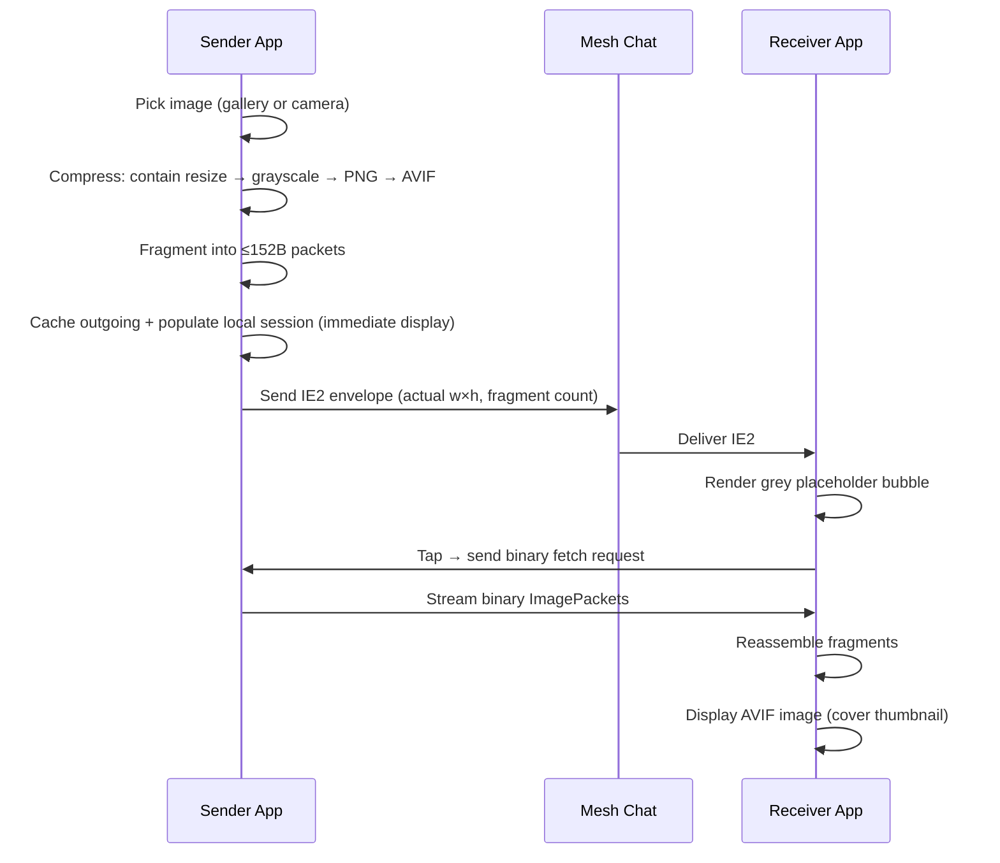

# Image Mode Technical Design

## 1. Overview

Image mode mirrors the voice on-demand architecture exactly:

- **Control plane (text messages):**
  - `IE2:` image envelope announces image availability in chat.
- **Control plane (raw binary request):**
  - Binary image fetch request (same raw route as image fragments).
- **Data plane (raw binary packets):**
  - `ImagePacket` binary payload streamed via `cmdSendRawData` / `pushRawData`.

Images are never broadcast in full to channels.  Chat carries only metadata;
pixels are fetched on demand when the user taps the image bubble.

## 2. Key Modules

- `lib/utils/image_message_parser.dart`
  - `ImagePacket` (binary fragment format)
  - `ImageEnvelope` (`IE2`)
  - `ImageFetchRequest` (binary)
  - `fragmentImage()` — split compressed bytes into packets
  - `reassembleImage()` — join received fragments into bytes
- `lib/screens/messages_tab.dart`
  - Pick image from gallery or camera, compress with user settings, cache, send envelope
- `lib/providers/image_provider.dart`
  - Reassembly sessions, outgoing cache, deferred serving
  - Outgoing sessions also registered as complete incoming sessions for immediate local display
- `lib/providers/app_provider.dart`
  - Incoming routing for `IE2`, binary image fetch requests, binary `0x49` packets
- `lib/widgets/messages/image_message_bubble.dart`
  - Square cover thumbnail (up to 256 px); tap-to-load for received images;
    progress ring during fetch; full-screen `InteractiveViewer` on tap
- `lib/services/image_codec_service.dart`
  - `ImageCodecService.compress()` — aspect-ratio-preserving resize + optional
    grayscale + AVIF encode via `flutter_avif`
- `lib/services/image_preferences.dart`
  - `ImagePreferences` — persists max size, compression level, grayscale toggle

## 3. Wire Formats

### 3.1 Image Envelope (`IE2`)

Prefix: `IE2:` + colon-delimited compact payload (base36 numeric fields)

Fields:

| Field        | Type   | Description                                    |
|--------------|--------|------------------------------------------------|
| `sid`        | string | base36 token for 32-bit session ID             |
| `fmt`        | base36 | `ImageFormat.id` (0 = AVIF, 1 = JPEG)         |
| `total`      | base36 | Fragment count (1..255)                        |
| `w`          | base36 | Actual image width after compression (pixels)  |
| `h`          | base36 | Actual image height after compression (pixels) |
| `bytes`      | base36 | Total compressed size in bytes                 |
| `senderKey6` | string | 12 hex chars (6 bytes sender prefix)           |
| `ts`         | base36 | Unix timestamp (seconds)                       |

Compact format:

```text
IE2:{sid}:{fmt}:{total}:{w}:{h}:{bytes}:{senderKey6}:{ts}
```

Example (256×171 landscape image, 14 fragments):

```text
IE2:a:0:e:74:4r:1mc:aabbccddeeff:s44we8
```

Note: `sid` is base36 on wire and expands to 8-hex internally.
`w` and `h` reflect the actual post-compression dimensions, which preserve
the source aspect ratio (contain within the configured max size).

### 3.2 Image Fetch Request (binary)

Binary payload format:

```text
[magic=0x69][sid:4B][flags:1B][requesterKey6:6B][ts:4B][missingCount:1B][missingIndices...]
```

| Field            | Value                    |
|------------------|--------------------------|
| `flags`          | bit0=1 => request missing indices, else all |
| `requesterKey6`  | 6-byte requester key prefix |
| `ts`             | unix timestamp seconds (u32) |

### 3.3 Raw Image Packet (data plane)

Binary payload structure:

- Byte 0: magic `0x49` (`'I'`)
- Bytes 1..4: session ID (4 bytes)
- Byte 5: format ID
- Byte 6: fragment index (0-based)
- Byte 7: total fragments
- Bytes 8..N: image data (max 152 bytes per fragment)

Header is 8 bytes — identical layout to `VoicePacket`.

## 4. Compression Pipeline

`ImageCodecService.compress(rawBytes, {maxDimension, compression, grayscale})`:

1. **Probe** — decode source image at original resolution to read `srcW × srcH`.
2. **Contain** — compute `dstW × dstH` that fits within `maxDimension × maxDimension`
   while preserving aspect ratio.  Images smaller than the cap are not upscaled.
3. **Decode** — `dart:ui.instantiateImageCodec` with `targetWidth: dstW, targetHeight: dstH`.
4. **RGBA export** — `image.toByteData(format: rawRgba)`.
5. **Grayscale** *(optional, default on)* — luminance `0.299R + 0.587G + 0.114B`
   applied in-place; if disabled, colour pixels are passed through unchanged.
6. **PNG re-encode** — `ui.ImageDescriptor.raw` → `toByteData(format: png)`.
   Required because `encodeAvif()` takes an encoded image, not raw RGBA.
7. **AVIF encode** — `flutter_avif.encodeAvif(pngBytes, maxQuantizer, minQuantizer, speed: 8)`.
   `compression` (10–90) maps to libavif CQ scale:
   `maxQ = round(compression/100 × 63)`, `minQ = round(maxQ × 0.65)`.
8. **Fragment** — `fragmentImage()` at 152 bytes/packet (≤255 packets).

Returns `({Uint8List bytes, int width, int height})` with the actual compressed dimensions.

### User-configurable settings (`ImagePreferences`)

| Setting      | Key                | Default | Range / Options |
|--------------|--------------------|---------|-----------------|
| Max size     | `image_max_size`   | 256     | 64 / 128 / 256  |
| Compression  | `image_quality`    | 90      | 10–90           |
| Grayscale    | `image_grayscale`  | true    | true / false    |

### Expected sizes (grayscale AVIF, compression 90)

| Max size | Typical size | Fragments |
|----------|--------------|-----------|
| 64×64    | 100–400 B    | 1–3       |
| 128×128  | 300–900 B    | 2–6       |
| 256×256  | 700–3000 B   | 5–20      |

Non-square images produce fewer fragments than the square equivalent because
only the shorter axis is padded — no cropping occurs.

## 5. Outgoing Flow (Send)

1. User picks image from gallery or camera (`image_picker`).
2. `ImagePreferences` is read: max size, compression, grayscale.
3. `ImageCodecService.compress()` returns `(bytes, width, height)`.
4. `fragmentImage()` splits bytes into `ImagePacket` list (≤255 fragments).
5. `ImageProvider.cacheOutgoingSession()` stores fragments in both the outgoing
   cache (for serving to peers) and the incoming session map (so the local bubble
   renders the image immediately without a fetch round-trip).
6. `ImageEnvelope` built with actual `width`/`height` from step 3.
7. Envelope sent via normal message path:
   - Channel: `sendChannelMessage`
   - Direct: `sendTextMessage`
8. Local placeholder message added (`IE2:` text, `deliveryStatus.sending`).

## 6. Incoming Flow (Receive)

### 6.1 `IE2` envelope received

`AppProvider` calls `imageProvider.registerEnvelope()` and adds the message to
chat.  The bubble shows a grey square placeholder with a download icon.

### 6.2 Binary image fetch request received

`AppProvider` treats it as control-plane only (not added to chat):

- Validates requester key prefix.
- Resolves requester contact.
- Calls `imageProvider.serveSessionTo()` which streams all cached fragments.

### 6.3 Raw packet received (`pushRawData`, magic `0x49`)

`AppProvider.onRawDataReceived` parses `ImagePacket` binary and calls
`imageProvider.addFragment()`.  When the session becomes complete, the bubble
automatically rebuilds with the full image.

## 7. Outgoing Cache Details

`ImageProvider` outgoing cache:

- key: `sessionId`
- value: encoded fragment list + cached envelope + timestamp
- TTL: 15 minutes
- eviction: lazy on access

When `cacheOutgoingSession()` is called it also writes all fragments into
`_sessions[sessionId]`, so the sender sees the image immediately in the bubble
(no tap-to-load required for own messages).

## 8. Display

`ImageMessageBubble` (max width 256 px):

- **Complete session**: `AspectRatio(1.0)` → `AvifImage.memory(fit: cover)`
  square thumbnail; tap → full-screen `InteractiveViewer` with fade transition.
- **Incomplete/missing**: grey square placeholder with download icon;
  tap → sends binary fetch request.
- **Loading**: circular progress indicator showing `received/total` count.
- **Error**: broken-image icon.

Status line below thumbnail:

- Sender: `🖼️ {w}×{h} AVIF · {n} seg`
- Receiver (complete): `🖼️ {w}×{h} AVIF`
- Receiver (pending): `🖼️ Tap to load · {w}×{h}`
- Loading: `📥 Loading… {received}/{total}`

## 9. Transmit Time Estimate (UI)

Image bubbles and Message Technical Details show an **estimated transmit time** (`~... tx`).

The estimate is airtime-based (LoRa packet model), not just compressed image size:

- Source inputs:
  - `total` fragments and `bytes` from `IE2` envelope
  - all numeric envelope values are decoded from base36
  - `pathLen` from message metadata
  - current radio params from `deviceInfo`: `radioBw`, `radioSf`, `radioCr`
- Per-fragment payload model:
  - `meshHeader(2)` + `pathLen` + `imageHeader(8)` + `fragmentBytes`
- LoRa airtime:
  - standard symbol-time formula (preamble + payload symbols)
- Mesh pacing/hops:
  - multiplied by `(1 + airtimeBudgetFactor)` where default factor is `1.0`
  - multiplied by hop count `(pathLen + 1)`
- Total estimate:
  - sum over all fragments

BW handling:

- If `radioBw` is index `0..9`, app maps it to Hz (`7.8k` .. `500k`)
- If `radioBw > 1000`, it is treated as Hz directly

Fallback defaults are used when radio params are unavailable: `SF10`, `BW250kHz`, `CR5`.

## 10. Persistence

`ImageProvider` stores sessions in `SharedPreferences` under key
`stored_image_sessions_v1`:

- Incoming: fragment list serialized as base64 binary packets.
- Outgoing: fragment list + envelope text + `cachedAt` timestamp.
- Expired outgoing sessions (> 15 min) are not restored on startup.

## 11. Operational Constraints

- No firmware changes required (reuses `cmdSendRawData` / `pushRawData`).
- On-demand fetch works only if sender app is online and has cached session.
- Raw return path requires a valid direct route to requester.
- Available on iOS and Android (`image_picker` + `flutter_avif`).

### 11.1 Raw Binary Routing Semantics

- Image fragment payloads use companion command `CMD_SEND_RAW_DATA` (`25` / `0x19`).
- Companion push back to the app is `PUSH_CODE_RAW_DATA` (`0x84`).
- Over-the-air packet type for this flow is `PAYLOAD_TYPE_RAW_CUSTOM` (`0x0F`).
- This flow is direct-route only, not flood/broadcast:
  - it is sent to one destination path;
  - only nodes on that path relay it;
  - it is **not** received by everyone in the mesh.

## 12. High-Level Sequence


